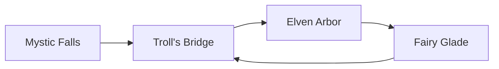

# Problem Set: Linked Lists (Harry Potter) — Week 6, Day 1

For every implementation problem, also evaluate the time and space complexity of your solution. Define your variables and explain why your solution has the stated complexity.

Unless a problem gives its own node class, problems use the shared `Node` class (`from references import Node`):

```python
class Node:
    def __init__(self, value, next=None, prev=None):
        self.value = value
        self.next = next
        self.prev = prev
```

---

## Problem 1: Why is it Always You Three (SKIPPED)

_Code-along problem — no function to implement. Starter code is in `prob01.py`._

### Description

In a single assignment statement, create the linked list `Harry -> Ron -> Hermione` and store its head in `head`.

`print_linked_list(head)` should print `Harry -> Ron -> Hermione`.

---

## Problem 2: 200 Points for Gryffindor

### Description

It's almost the end of the year, and Gryffindor wants to know if anyone is competing for first place. Given the head of a linked list `house_points` and Gryffindor's `score`, write a function `prob02()` that returns how many times `score` appears in the list.

This problem uses its own node class, where each node holds a house and its score:

```python
class Node:
    def __init__(self, house, score, next=None):
        self.house = house
        self.value = score
        self.next = next
```

### Function Signature

```python
def prob02(house_points, score):
    pass
```

### Examples

**Example 1:**
```
Input:  house_points = ("Gryffindor", 600) -> ("Ravenclaw", 300) -> ("Slytherin", 500) -> ("Hufflepuff", 600),
        score = 600
Output: 2
```

---

## Problem 3: Target Practice

### Description

You are extracting the middle ingredient in a line of potions. Given the head of a linked list `potions`, write a function `prob03()` that returns the potion in the middle node. If there are two middle nodes, return the potion of the second one.

Use the **slow and fast pointer** ("tortoise and hare") technique: a slow pointer and a fast pointer that move at different speeds.

This problem uses its own node class, where each node holds a `potion`:

```python
class Node:
    def __init__(self, potion, next=None):
        self.potion = potion
        self.next = next
```

### Function Signature

```python
def prob03(potions):
    pass
```

### Examples

**Example 1:**
```
Input:  potions = Poison Antidote -> Shrinking Solution -> Trollblood Tincture
Output: "Shrinking Solution"
```

**Example 2:**
```
Input:  potions = Elixir of Life -> Sleeping Draught -> Babbling Beverage -> Aging Potion
Output: "Babbling Beverage"
```

---

## Problem 4: Turn Back Time

### Description

A spell gone wrong has reversed time! Write a function `prob04()` that takes the head of a singly linked list `events`, reverses the order of its nodes, and returns the head of the reversed list.

### Function Signature

```python
def prob04(events):
    pass
```

### Examples

**Example 1:**
```
Input:  events = Potion Brewing -> Spell Casting -> Wand Making -> Dragon Taming -> Broomstick Flying
Output: Broomstick Flying -> Dragon Taming -> Wand Making -> Spell Casting -> Potion Brewing
```

---

## Problem 5: Mirror, Mirror

### Description

Wonky spell casting may have broken your enchanted mirror. Write a function `prob05()` that takes the `head` of a linked list and returns `True` if its values read the same forwards and backwards, and `False` otherwise.

### Function Signature

```python
def prob05(head):
    pass
```

### Examples

**Example 1:**
```
Input:  head = Phoenix -> Dragon -> Phoenix
Output: True
```

**Example 2:**
```
Input:  head = Werewolf -> Vampire -> Griffin
Output: False
```

---

## Problem 6: Magic Loop

### Description

Magical paths in an enchanted forest sometimes loop back on themselves. Write a function `prob06()` that takes the head of a linked list `path_start` and returns the value of the node where the cycle starts. If there is no cycle, return `None`.

A linked list has a cycle if some node's `next` pointer points back to an earlier node in the list.

### Function Signature

```python
def prob06(path_start):
    pass
```

### Examples

**Example 1:** the fourth node points back to the second node.



```
Input:  path_start = Mystic Falls (list shown above)
Output: "Troll's Bridge"
```

---
