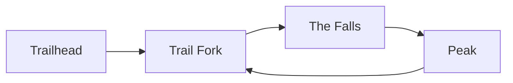

# Problem Set: Linked Lists (Trails) — Week 6, Day 2

For every problem, also evaluate the time and space complexity of your solution. Define your variables and explain why your solution has the stated complexity.

Problems use the shared `Node` class (`from references import Node`):

```python
class Node:
    def __init__(self, value, next=None, prev=None):
        self.value = value
        self.next = next
        self.prev = prev
```

---

## Problem 1: Measuring Loop Length

### Description

You are measuring a loop trail that circles back to its start. Given the head of a linked list `trailhead`, where each node is a trail marker and the last marker points back to the first, write a function `prob01()` that returns the length of the trail: the number of markers.

### Function Signature

```python
def prob01(trailhead):
    pass
```

### Examples

**Example 1:** the third marker points back to the first.


```
Input:  trailhead = Marker 1 (loop shown above)
Output: 3
```

---

## Problem 2: Clearing the Path

### Description

Some parts of a trail loop back on themselves, creating confusing detours. Given the head of a linked list `trailhead` that may contain a cycle, write a function `prob02()` that removes the cycle so the trail is a straight path, and returns the head of the cleared trail.

Every node stays in the list; only the link that closes the loop is cut, so the last node points to `None`.

### Function Signature

```python
def prob02(trailhead):
    pass
```

### Examples

**Example 1:** the fourth marker points back to the second.



```
Input:  trailhead = Trailhead (loop shown above)
Output: Trailhead -> Trail Fork -> The Falls -> Peak
```

_Careful: printing a list that still has a cycle loops forever._

---

## Problem 3: Removing Duplicate Markers

### Description

Some markers on an old trail were placed more than once. Given the head of a sorted linked list of numbered markers `trailhead`, write a function `prob03()` that removes **every** marker whose number appears more than once, keeping only the numbers that appear exactly once. Return the head of the updated trail.

### Function Signature

```python
def prob03(trailhead):
    pass
```

### Examples

**Example 1:**
```
Input:  trailhead = 1 -> 2 -> 3 -> 3 -> 4
Output: 1 -> 2 -> 4
Explanation: 3 appears more than once, so every 3 is removed.
```

### Constraints

- The list is sorted in ascending order

---

## Problem 4: Controlled Burns

### Description

Foresters are doing controlled burns, so parts of the trail will be off limits this season. Given the head of a linked list of markers `trailhead` and two integers `m` and `n`, write a function `prob04()` that walks the trail keeping the first `m` markers, then removing the next `n` markers, repeating until the end of the trail. Return the head of the updated trail.

### Function Signature

```python
def prob04(trailhead, m, n):
    pass
```

### Examples

**Example 1:**
```
Input:  trailhead = 1 -> 2 -> 3 -> 4 -> 5 -> 6 -> 7 -> 8 -> 9 -> 10 -> 11 -> 12 -> 13, m = 2, n = 3
Output: 1 -> 2 -> 6 -> 7 -> 11 -> 12
Explanation: Keep the first 2 nodes (1 -> 2), delete the next 3 (3 -> 4 -> 5), and repeat until the end.
```

_Note: the source example builds the list 1 to 10 but prints the output for 1 to 13. The input here is 1 to 13 so the output is correct. With 1 to 10, the output would be `1 -> 2 -> 6 -> 7`._

---

## Problem 5: Geocaching

### Description

Each marker on a trail hides a geocache labeled 0 or 1. Together, the labels form a binary number giving the coordinates of a special hidden cache. The most significant bit is at the first marker. Given the head of a linked list `cache_labels` of 0s and 1s, write a function `prob05()` that returns the decimal value of the binary number.

### Function Signature

```python
def prob05(cache_labels):
    pass
```

### Examples

**Example 1:**
```
Input:  cache_labels = 1 -> 0 -> 1
Output: 5
Explanation: 101 in base 2 is 5 in base 10.
```

---

## Problem 6: Merging Trail Segments

### Description

A new trail has segments separated by temporary markers with value `0`. Given the head of a linked list `trailhead`, write a function `prob06()` that merges the nodes between each pair of `0`s into a single node holding their sum. The final trail contains no `0` markers. Return the head of the merged trail.

### Function Signature

```python
def prob06(trailhead):
    pass
```

### Examples

**Example 1:**
```
Input:  trailhead = 0 -> 3 -> 1 -> 0 -> 4 -> 5 -> 2 -> 0
Output: 4 -> 11
Explanation: 3 + 1 = 4 and 4 + 5 + 2 = 11.
```

**Example 2:**
```
Input:  trailhead = 0 -> 1 -> 0 -> 3 -> 0 -> 2 -> 2 -> 0
Output: 1 -> 3 -> 4
Explanation: 1 = 1, 3 = 3, and 2 + 2 = 4.
```

### Constraints

- The list starts and ends with `0`
- There is at least one non-zero node between every two consecutive `0`s

---
