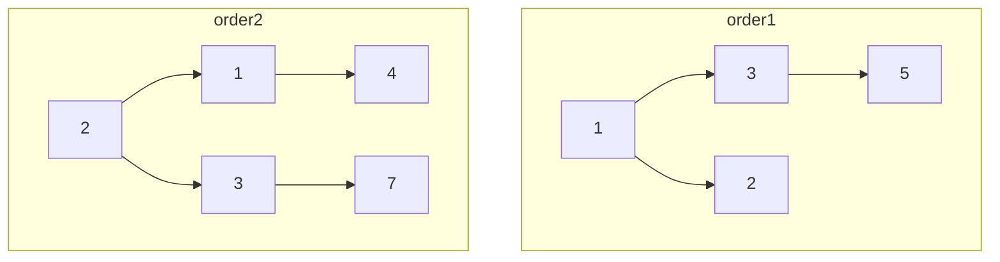
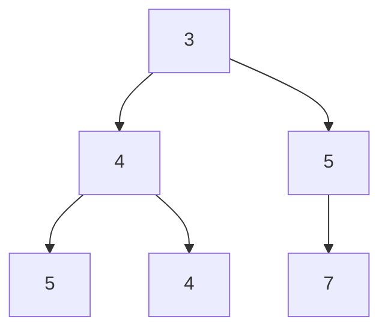
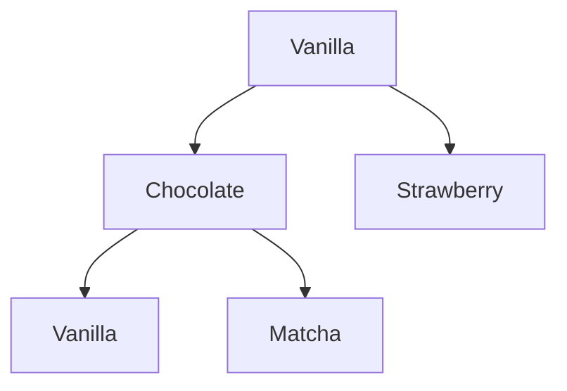
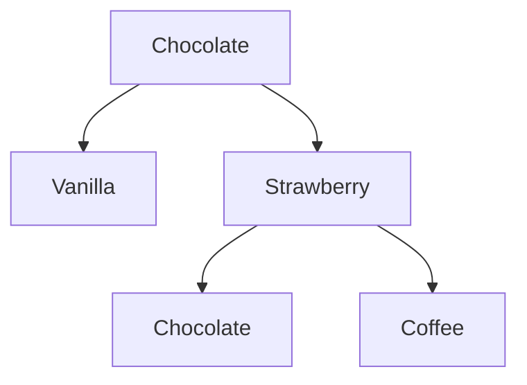
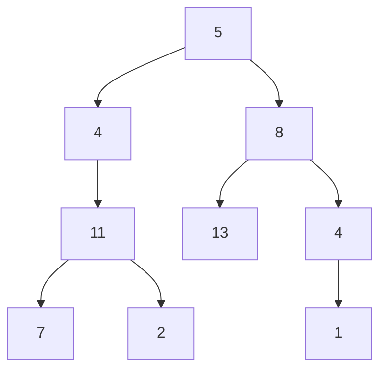
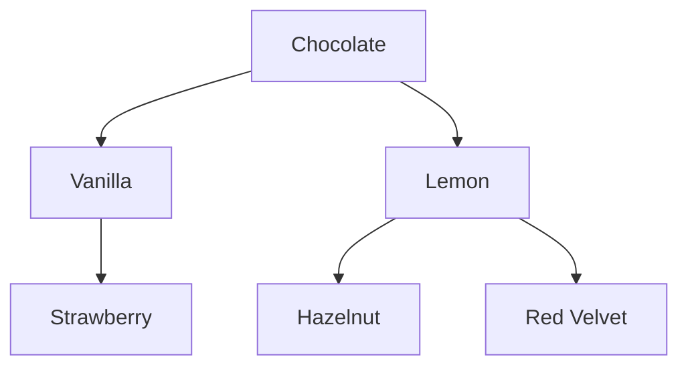

# Problem Set: Binary Trees — BFS & DFS (Bakery) — Week 9, Day 1

For every problem, also evaluate the time complexity of your solution. Define your variables and explain why your solution has the stated complexity. Assume the input tree is balanced.

All problems use the shared `TreeNode` class (`from references import TreeNode`). The source's `Puff` class has the same shape; the attribute is `.val`:

```python
class TreeNode:
    def __init__(self, value, left=None, right=None):
        self.val = value
        self.left = left
        self.right = right
```

Examples written as a list (e.g. `[1, 3, 2, 5]`) describe a tree in **level order**, where `None` means "no node here". `build_tree(values)` turns such a list into a tree, and `print_tree(root)` prints a tree back in the same format.

---

## Problem 1: Merging Cookie Orders

### Description

You run a bakery and are given the roots of two binary trees, `order1` and `order2`, where each node is the number of a certain cookie type ordered. Write a function `prob01()` that merges the two orders into one tree and returns its root.

Imagine placing one tree on top of the other. Where two nodes overlap, the merged node's value is their sum. Where only one tree has a node, that node is used in the merged tree. Start merging from the roots of both trees.

### Function Signature

```python
def prob01(order1: TreeNode | None, order2: TreeNode | None) -> TreeNode | None:
    pass
```

### Examples

**Example 1:**



```
Input:  order1 = [1, 3, 2, 5], order2 = [2, 1, 3, None, 4, None, 7]
Output: [3, 4, 5, 5, 4, None, 7]
```

The merged tree:



In the merged tree, `4` has children `5` (left) and `4` (right), and `5` has only a right child, `7`.

---

## Problem 2: Croquembouche

### Description

You designed a croquembouche (a cone-shaped tower of cream puffs) and want to send the design to the couple for review. Given the root of a binary tree `design`, where each node is a cream puff, write a function `prob02()` that **prints** a list of the flavors (`val`s) in level order: left to right, level by level.

Try to write the level order traversal yourself rather than copying from `build_tree()` or `print_tree()`.

### Function Signature

```python
def prob02(design: TreeNode | None) -> None:
    pass
```

### Examples

**Example 1:**



```
Input:  design = TreeNode("Vanilla", TreeNode("Chocolate", TreeNode("Vanilla"), TreeNode("Matcha")), TreeNode("Strawberry"))
Output (printed): ['Vanilla', 'Chocolate', 'Strawberry', 'Vanilla', 'Matcha']
```

---

## Problem 3: Maximum Tiers in Cake

### Description

Your competition cake is a pyramid where different sections have different numbers of tiers. Given the root of a binary tree `cake`, where each node is a section, write a function `prob03()` that returns the maximum number of tiers: the number of nodes on the longest path from the root down to the farthest leaf.

### Function Signature

```python
def prob03(cake: TreeNode | None) -> int:
    pass
```

### Examples

**Example 1:**



```
Input:  cake = ["Chocolate", "Vanilla", "Strawberry", None, None, "Chocolate", "Coffee"]
Output: 3
```

---

## Problem 4: Maximum Tiers in Cake II

### Description

If you solved Problem 3 with depth first search (DFS), solve it again with breadth first search (BFS). If you used BFS, use DFS. The function `prob04()` behaves exactly like Problem 3.

### Function Signature

```python
def prob04(cake: TreeNode | None) -> int:
    pass
```

### Examples

**Example 1:**
```
Input:  cake = ["Chocolate", "Vanilla", "Strawberry", None, None, "Chocolate", "Coffee"]
Output: 3
```

---

## Problem 5: Can Fulfill Order

### Description

Your bakery stock is a binary tree `inventory`, where each node is the quantity of a baked good. A customer wants an assortment totaling `order_size`. Write a function `prob05()` that returns `True` if the tree has a **root-to-leaf** path whose values add up to `order_size`, and `False` otherwise.

### Function Signature

```python
def prob05(inventory: TreeNode | None, order_size: int) -> bool:
    pass
```

### Examples



Here `4` (left child of `5`) has only a left child, `11`, and the `4` under `8` has only a right child, `1`.

**Example 1:**
```
Input:  inventory = [5, 4, 8, 11, None, 13, 4, 7, 2, None, None, None, 1], order_size = 22
Output: True
Explanation: 5 + 4 + 11 + 2 = 22
```

**Example 2:**
```
Input:  inventory = [5, 4, 8, 11, None, 13, 4, 7, 2, None, None, None, 1], order_size = 2
Output: False
```

---

## Problem 6: Icing Cupcakes in Zigzag Order

### Description

Your cupcakes are arranged as a binary tree `cupcakes`, where each node is a cupcake. You ice one row (level) at a time in zigzag order: the first row left to right, the next right to left, and so on, alternating. Write a function `prob06()` that returns a list of the cupcake values in the order you iced them.

### Function Signature

```python
def prob06(cupcakes: TreeNode | None) -> list[str]:
    pass
```

### Examples

**Example 1:**



```
Input:  cupcakes = ["Chocolate", "Vanilla", "Lemon", "Strawberry", None, "Hazelnut", "Red Velvet"]
Output: ['Chocolate', 'Lemon', 'Vanilla', 'Strawberry', 'Hazelnut', 'Red Velvet']
```

---
