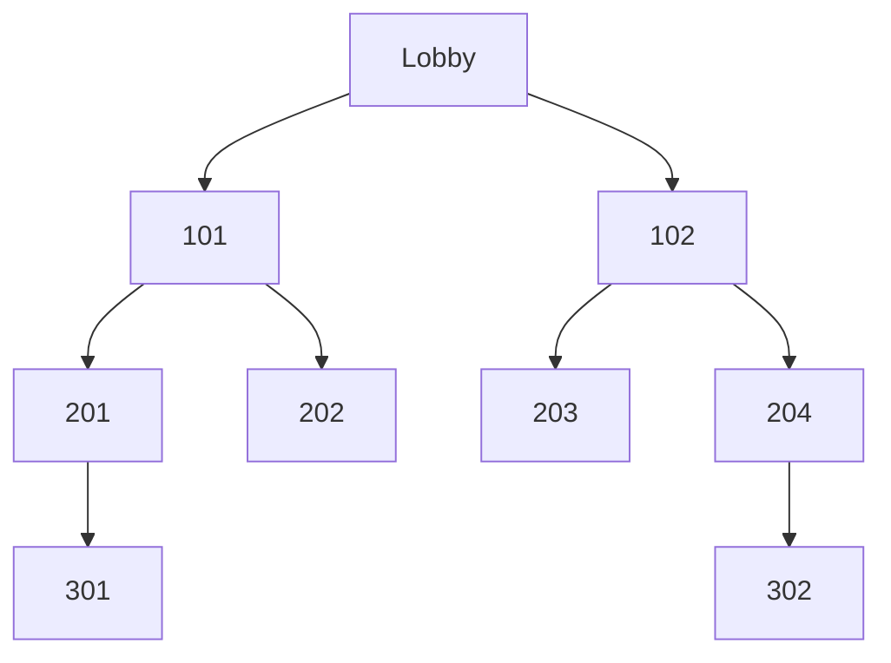
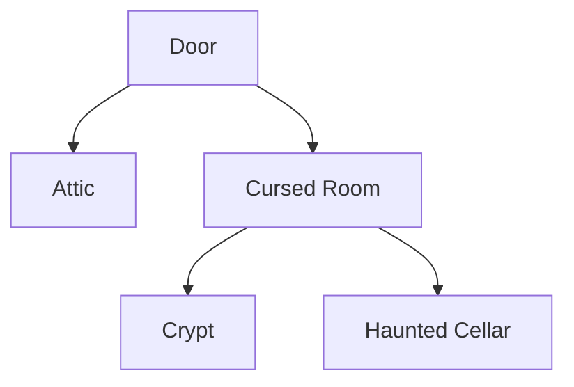
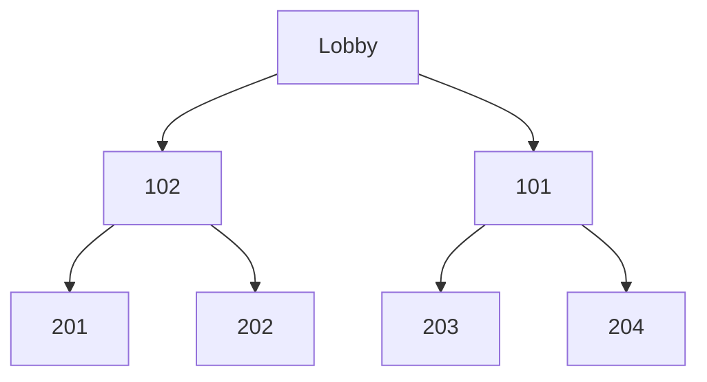
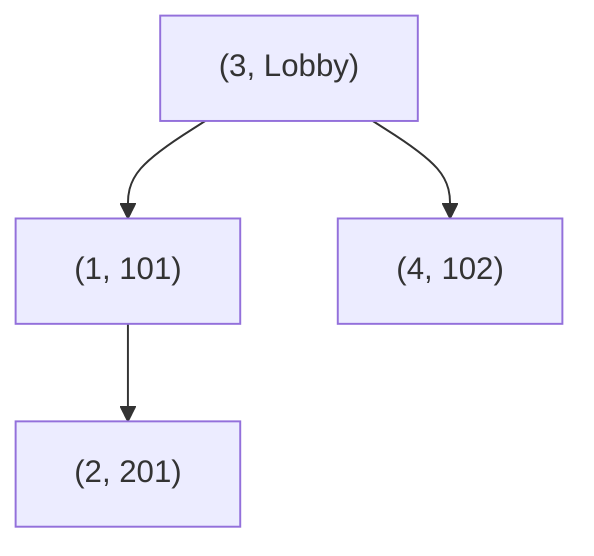
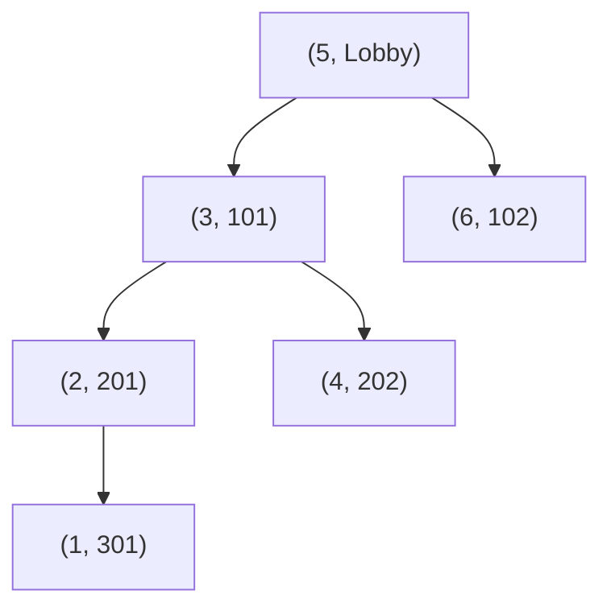

# Problem Set: Binary Trees — BFS & DFS (Haunted Hotel) — Week 9, Day 1

For every problem, also evaluate the time complexity of your solution. Define your variables and explain why your solution has the stated complexity. Assume the input tree is balanced.

All problems use the shared `TreeNode` class (`from references import TreeNode`). The source's examples also build trees with a `Room` class that is never defined; it has the same shape as `TreeNode`, so `TreeNode` is used everywhere here:

```python
class TreeNode:
    def __init__(self, value, left=None, right=None, key=None):
        self.val = value
        self.key = key  # only used by Problem 6
        self.left = left
        self.right = right
```

Examples written as a list describe a tree in **level order**, where `None` means "no node here". `build_tree(values)` turns such a list into a tree, and `print_tree(root)` prints a tree back in the same format.

---

## Problem 1: Clone Detection

### Description

You work the night shift at a hotel that may be haunted, and you think you've been seeing double of some guests. Given the roots of two binary trees `guest1` and `guest2`, write a function `prob01()` that returns `True` if they are clones and `False` otherwise.

Two trees are clones if they are structurally identical and their nodes have the same values.

### Function Signature

```python
def prob01(guest1: TreeNode | None, guest2: TreeNode | None) -> bool:
    pass
```

### Examples

**Example 1:**
```
Input:  guest1 = TreeNode("John Doe", TreeNode("6 ft"), TreeNode("Brown Eyes"))
        guest2 = TreeNode("John Doe", TreeNode("6 ft"), TreeNode("Brown Eyes"))
Output: True
```

**Example 2:**
```
Input:  guest1 = TreeNode("John Doe", TreeNode("6 ft"))          # "6 ft" is a left child
        guest2 = TreeNode("John Doe", None, TreeNode("6 ft"))    # "6 ft" is a right child
Output: False
```

---

## Problem 2: Mapping a Haunted Hotel

### Description

Guests keep checking out of rooms you're sure don't exist. To check, you want to map the whole hotel. Given the root of a binary tree `hotel`, where each node is a room, write a function `prob02()` that returns a list of every room value, exploring level by level from left to right.

Try to write the level order traversal yourself rather than copying from `build_tree()` or `print_tree()`.

### Function Signature

```python
def prob02(hotel: TreeNode | None) -> list[int | str]:
    pass
```

### Examples

**Example 1:**



`301` is the left child of `201`, and `302` is the right child of `204`.

```
Input:  hotel = TreeNode("Lobby",
                    TreeNode(101, TreeNode(201, TreeNode(301)), TreeNode(202)),
                    TreeNode(102, TreeNode(203), TreeNode(204, None, TreeNode(302))))
Output: ['Lobby', 101, 102, 201, 202, 203, 204, 301, 302]
```

---

## Problem 3: Minimum Depth of Secret Path

### Description

You found a strange door in the hotel. Given the root of a binary tree `door`, where each node is a destination behind the door, write a function `prob03()` that returns the minimum depth of the tree: the number of nodes on the shortest path from the root down to the nearest **leaf** (a node with no children).

### Function Signature

```python
def prob03(door: TreeNode | None) -> int:
    pass
```

### Examples

**Example 1:**



```
Input:  door = TreeNode("Door", TreeNode("Attic"), TreeNode("Cursed Room", TreeNode("Crypt"), TreeNode("Haunted Cellar")))
Output: 2
```

---

## Problem 4: Minimum Depth of Secret Path II

### Description

If you solved Problem 3 with breadth first search (BFS), solve it again with depth first search (DFS). If you used DFS, use BFS. The function `prob04()` behaves exactly like Problem 3.

_Note: the source example calls `min_depth(attic)`; it should be `min_depth(door)`._

### Function Signature

```python
def prob04(door: TreeNode | None) -> int:
    pass
```

### Examples

**Example 1:**
```
Input:  door = TreeNode("Door", TreeNode("Attic"), TreeNode("Cursed Room", TreeNode("Crypt"), TreeNode("Haunted Cellar")))
Output: 2
```

---

## Problem 5: Reverse Odd Levels of the Hotel

### Description

A poltergeist reversed the order of rooms on the odd-level floors. Given the root of a **perfect** binary tree `hotel`, write a function `prob05()` that restores order by reversing the node values at every odd level, and returns the root.

- A binary tree is **perfect** if every parent has two children and all leaves are on the same level.
- The **level** of a node is the number of edges between it and the root, so the root is level 0.

For example, if the rooms on level 3 are `[308, 307, 306, 305, 304, 303, 302, 301]`, they become `[301, 302, 303, 304, 305, 306, 307, 308]`.

### Function Signature

```python
def prob05(hotel: TreeNode | None) -> TreeNode | None:
    pass
```

### Examples

**Example 1:**



```
Input:  hotel = ["Lobby", 102, 101, 201, 202, 203, 204]
Output: ['Lobby', 101, 102, 201, 202, 203, 204]
Explanation: Level 1 (102, 101) is reversed to (101, 102). Level 2 is even, so it is unchanged.
```

---

## Problem 6: Kth Spookiest Room in the Hotel

### Description

You are given the root of a binary search tree (BST) with `n` nodes, where each node is a room. Each node's `key` is the room's spookiness (1 is most spooky, `n` is least spooky) and its `val` is the room number. The tree is ordered by `key`.

Given the root and an integer `k`, write a function `prob06()` that returns the `val` of the `k`th spookiest room.

With the shared class, a node is created as `TreeNode(val, key=key)`.

### Function Signature

```python
def prob06(root: TreeNode | None, k: int) -> int | str:
    pass
```

### Examples

**Example 1:**



`(2, 201)` is the right child of `(1, 101)`.

```
Input:  root = [(3, "Lobby"), (1, 101), (4, 102), None, (2, 201)], k = 1
Output: 101
```

**Example 2:**



```
Input:  root = [(5, "Lobby"), (3, 101), (6, 102), (2, 201), (4, 202), None, None, (1, 301)], k = 3
Output: 101
```

---
