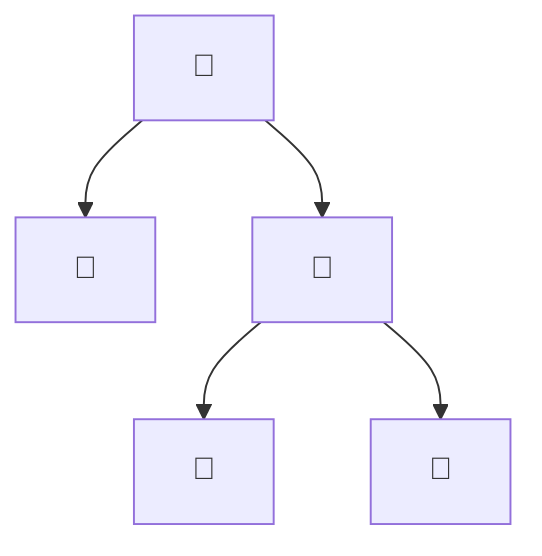
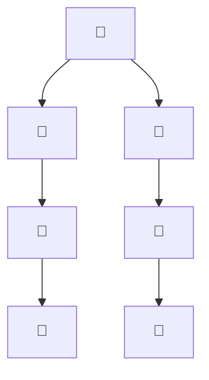
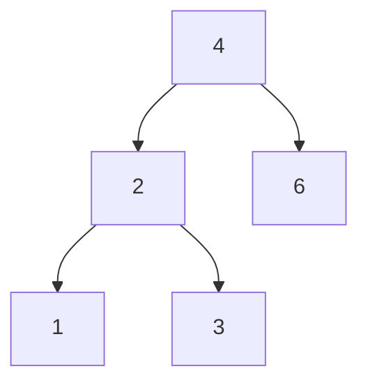
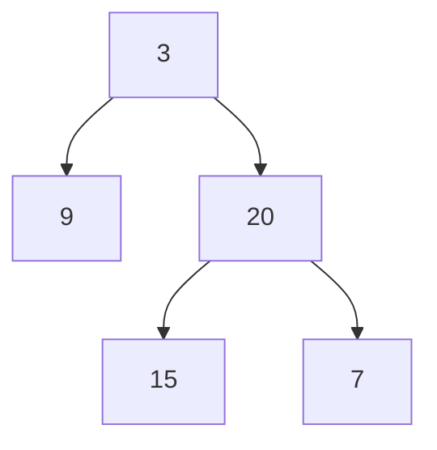
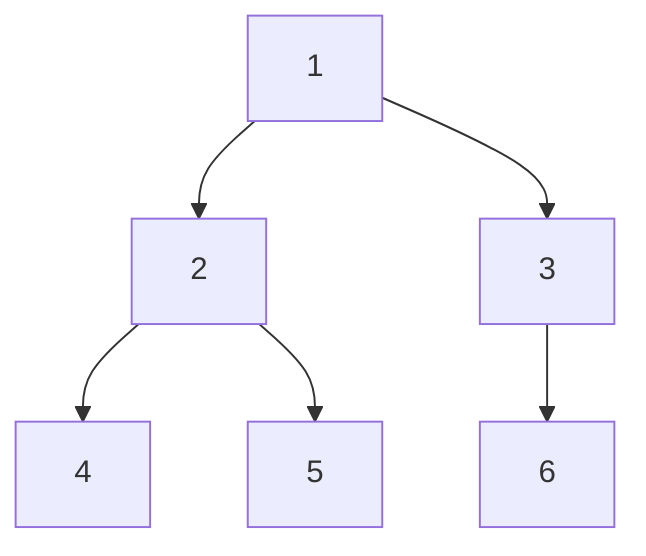
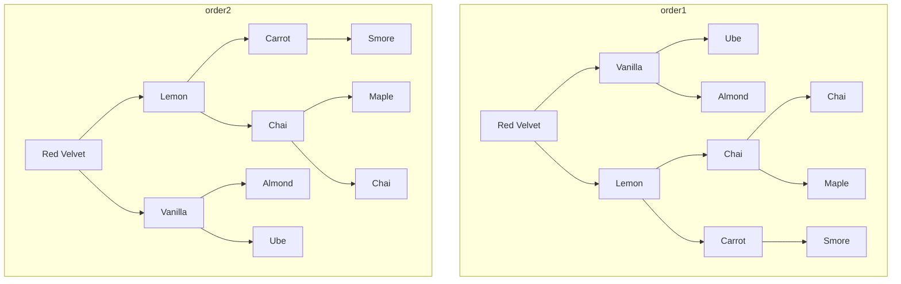
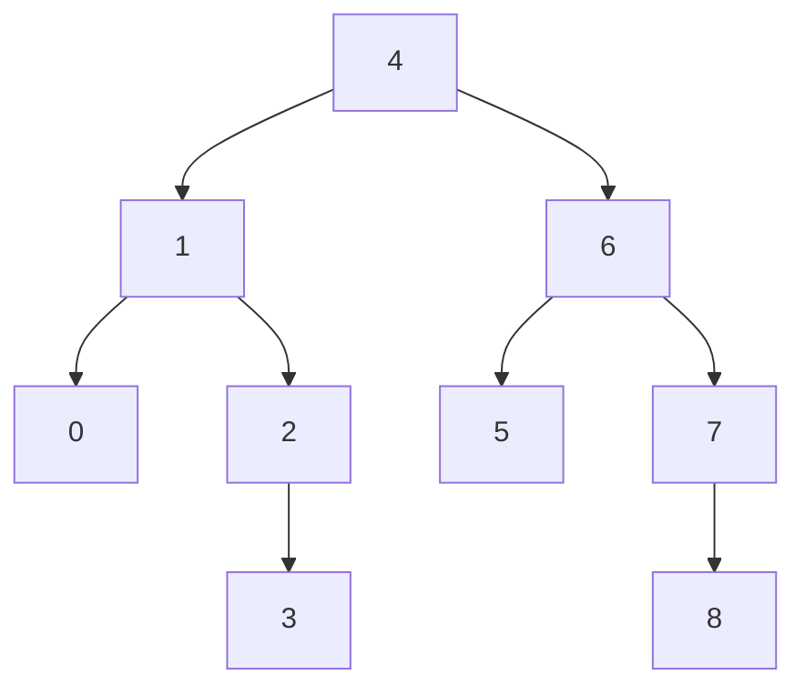
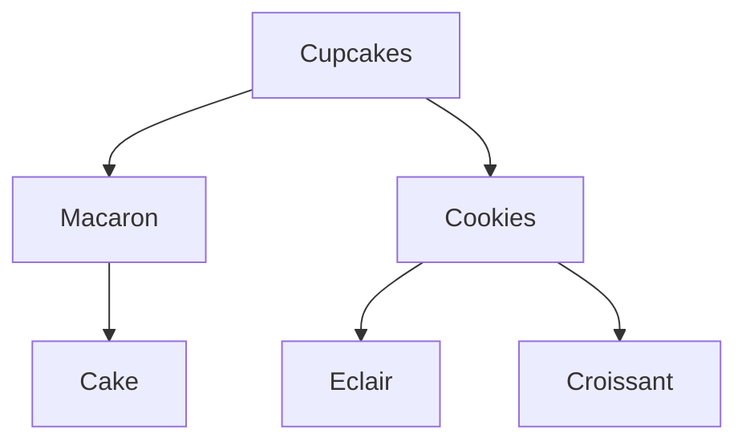

# Problem Set: Binary Trees II (Bakery) — Week 9, Day 2

For every problem, also evaluate the time complexity of your solution. Define your variables and explain why your solution has the stated complexity.

All problems use the shared `TreeNode` class (`from references import TreeNode`); the attribute is `.val`:

```python
class TreeNode:
    def __init__(self, value, left=None, right=None):
        self.val = value
        self.left = left
        self.right = right
```

Examples written as a list describe a tree in **level order**, where `None` means "no node here". `build_tree(values)` turns such a list into a tree, and `print_tree(root)` prints a tree back in the same format.

---

## Problem 1: Balanced Baked Goods Display

### Description

Given the root of a binary tree `display` of the baked goods on show, write a function `prob01()` that returns `True` if the tree is **balanced** and `False` otherwise. A tree is balanced if, at every node, the heights of the left and right subtrees differ by at most one.

### Function Signature

```python
def prob01(display: TreeNode | None) -> bool:
    pass
```

### Examples

**Example 1:**



```
Input:  display = ["🎂", "🥮", "🍩", None, None, "🥖", "🧁"]
Output: True
```

**Example 2:**



The left `🧁` has only a left child, and the right `🧁` has only a right child; each chain continues the same way.

```
Input:  display = ["🥖", "🧁", "🧁", "🍪", None, None, "🍪", "🥐", None, None, "🥐"]
Output: False
Explanation: Each 🧁 has a subtree of height 2 on one side and nothing on the other.
```

---

## Problem 2: Sum of Cookies Sold Each Day

### Description

Each customer order is a node in a binary tree, and each node's value is the number of cookies ordered. Each level of the tree is one day's orders. Given the root `orders`, write a function `prob02()` that returns a list of the cookie totals for each day (level).

### Function Signature

```python
def prob02(orders: TreeNode | None) -> list[int]:
    pass
```

### Examples

**Example 1:**



```
Input:  orders = [4, 2, 6, 1, 3]
Output: [4, 8, 4]
```

---

## Problem 3: Sweetness Difference

### Description

Given the root of a binary tree `chocolates`, where each node is a chocolate and its value is its sweetness, write a function `prob03()` that returns a list of the differences between the highest and lowest sweetness in each row (level). A row with one chocolate has a difference of 0.

_Note: the source example refers to undefined names (`sweetness_levels`, `chocolatebox1`); the inputs below are the intended ones._

### Function Signature

```python
def prob03(chocolates: TreeNode | None) -> list[int]:
    pass
```

### Examples

**Example 1:**



```
Input:  chocolates = [3, 9, 20, None, None, 15, 7]
Output: [0, 11, 8]
```

**Example 2:**



`6` is the right child of `3`.

```
Input:  chocolates = [1, 2, 3, 4, 5, None, 6]
Output: [0, 1, 2]
```

---

## Problem 4: Transformable Bakery Orders

### Description

Each order is a binary tree: node values are cupcake types, and the structure is how they sit in the box. You can swap the left and right subtrees of any node, any number of times. Given the roots `order1` and `order2`, write a function `prob04()` that returns `True` if `order1` can be rearranged this way to match `order2`, and `False` otherwise.

### Function Signature

```python
def prob04(order1: TreeNode | None, order2: TreeNode | None) -> bool:
    pass
```

### Examples

**Example 1:**



In `order1`, `Smore` is the right child of `Carrot`; in `order2`, it is the left child.

```
Input:  order1 = ["Red Velvet", "Vanilla", "Lemon", "Ube", "Almond", "Chai", "Carrot",
                  None, None, None, None, "Chai", "Maple", None, "Smore"]
        order2 = ["Red Velvet", "Lemon", "Vanilla", "Carrot", "Chai", "Almond", "Ube", "Smore", None, "Maple", "Chai"]
Output: True
Explanation: Swap the children of Red Velvet, Vanilla, Lemon, the upper Chai, and Carrot.
```

---

## Problem 5: Larger Order Tree

### Description

You have the root of a binary search tree `orders`, where each node's value is the number of cupcakes in an order. Write a function `prob05()` that converts it into a **larger order tree**: each node's new value is its original value plus the sum of all values greater than it. Return the root.

A BST satisfies:

- The left subtree of a node contains only values less than the node's value.
- The right subtree of a node contains only values greater than the node's value.
- Both subtrees are also BSTs.

Also evaluate the space complexity of your solution.

### Function Signature

```python
def prob05(orders: TreeNode | None) -> TreeNode | None:
    pass
```

### Examples

**Example 1:**



`3` is the right child of `2`, and `8` is the right child of `7`.

```
Input:  orders = [4, 1, 6, 0, 2, 5, 7, None, None, None, 3, None, None, None, 8]
Output: [30, 36, 21, 36, 35, 26, 15, None, None, None, 33, None, None, None, 8]
```

---

## Problem 6: Find Next Order to Fulfill Today

### Description

Each order is a node in a binary tree, and each level is one day's orders. Given the root `order_tree` and a `TreeNode` `order` (the order you are fulfilling now), write a function `prob06()` that returns the next order that day: the nearest node to the right on the same level. Return `None` if `order` is the rightmost node on its level.

Because `order` must be a node from the tree, build the tree by hand rather than with `build_tree()`.

_Note: the source prints `next_order2.val`, which would crash because `next_order2` is `None`._

### Function Signature

```python
def prob06(order_tree: TreeNode | None, order: TreeNode) -> TreeNode | None:
    pass
```

### Examples



`Cake` is the right child of `Macaron`.

**Example 1:**
```
Input:  order_tree = cupcakes, order = cake
Output: the Eclair node
```

**Example 2:**
```
Input:  order_tree = cupcakes, order = cookies
Output: None
```

---
