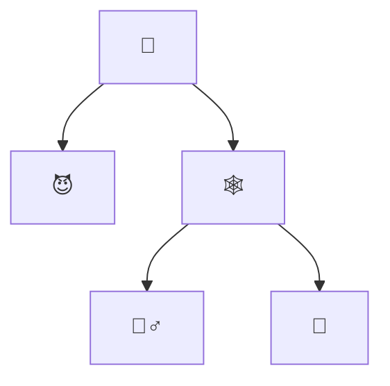
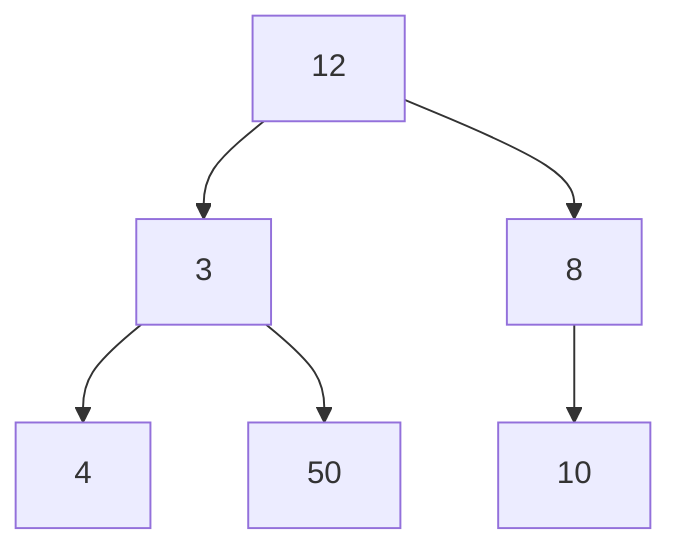
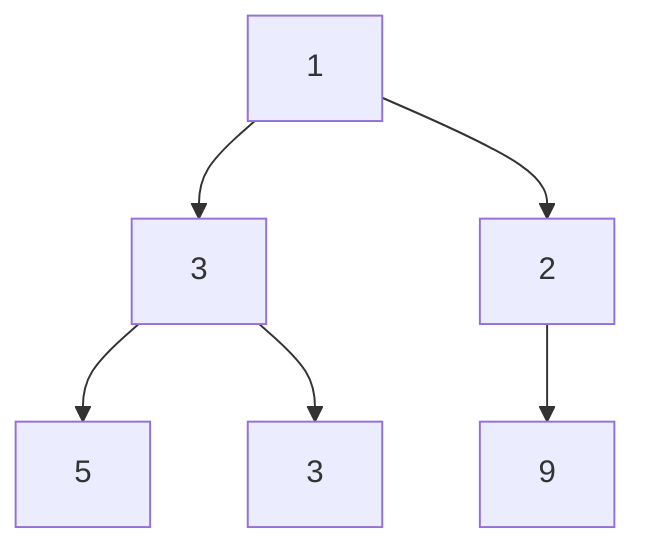
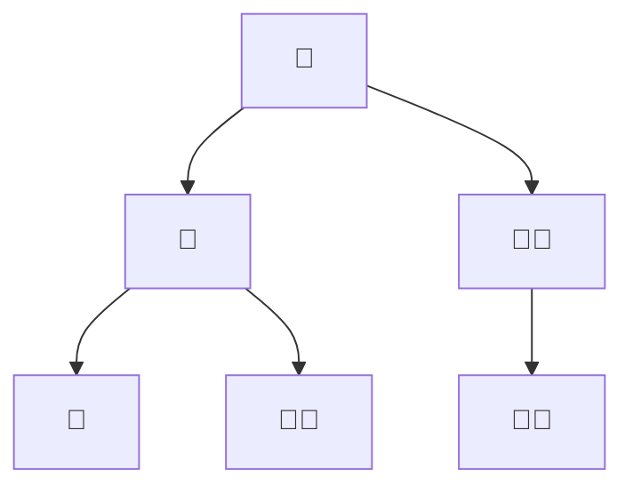
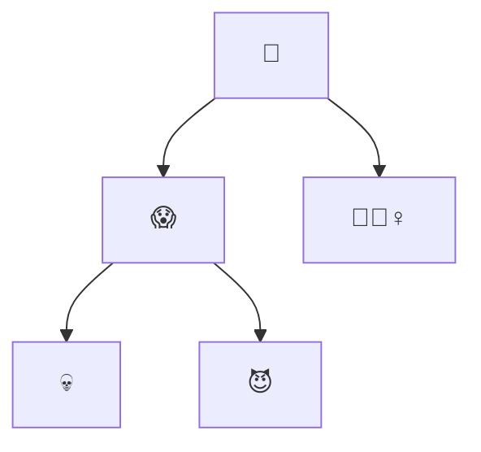
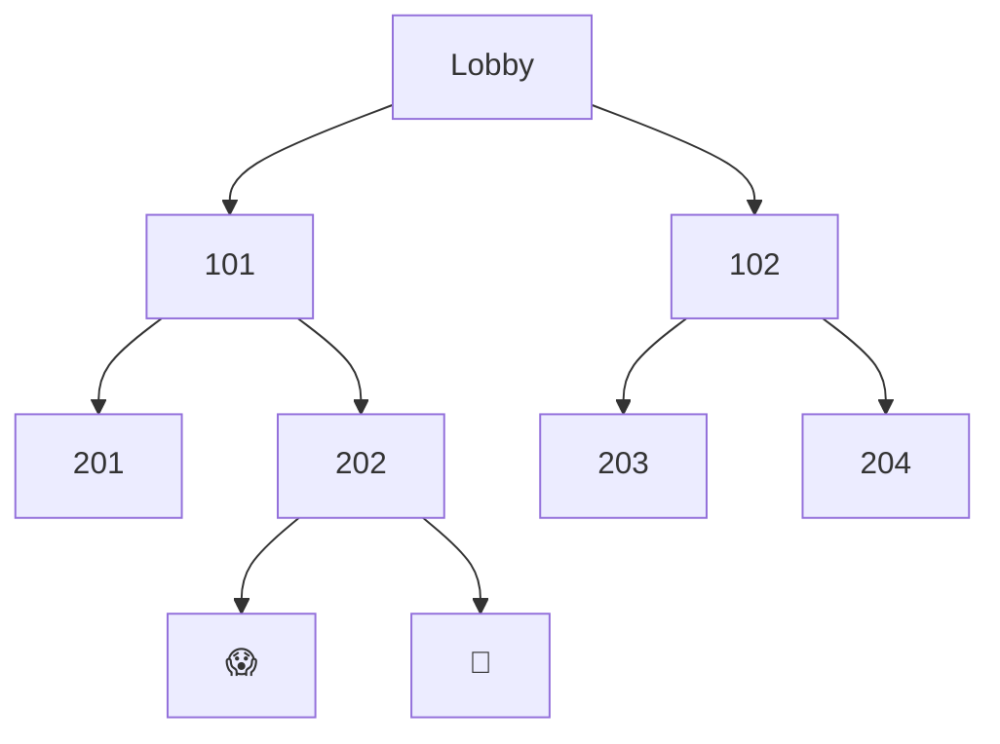

# Problem Set: Binary Trees II (Haunted Hotel) — Week 9, Day 2

For every problem, also evaluate the time complexity of your solution. Define your variables and explain why your solution has the stated complexity.

All problems use the shared `TreeNode` class (`from references import TreeNode`); the attribute is `.val`:

```python
class TreeNode:
    def __init__(self, value, left=None, right=None):
        self.val = value
        self.left = left
        self.right = right
```

Examples written as a list describe a tree in **level order**, where `None` means "no node here". `build_tree(values)` turns such a list into a tree, and `print_tree(root)` prints a tree back in the same format.

---

## Problem 1: Haunted Mirror

### Description

A vampire staying at the hotel can't see reflections in the mirror. Given the root of a binary tree `vampire`, write a function `prob01()` that returns its mirror image: the tree flipped along its vertical axis, so every node's left and right children are swapped.

### Function Signature

```python
def prob01(vampire: TreeNode | None) -> TreeNode | None:
    pass
```

### Examples

**Example 1:**
```
Input:  vampire = ["🧛‍♂️", "💪🏼", "🤳", "👟", None, None, "👞"]
Output: ['🧛‍♂️', '🤳', '💪🏼', '👞', None, None, '👟']
```

**Example 2:**



```
Input:  vampire = ["🎃", "😈", "🕸️", None, None, "🧟‍♂️", "👻"]
Output: ['🎃', '🕸️', '😈', '👻', '🧟‍♂️']
```

---

## Problem 2: Pumpkin Patch Path

### Description

Each node of a binary tree is a section of a pumpkin patch, and its value is the number of pumpkins. Given the `root`, write a function `prob02()` that finds the root-to-leaf path with the most pumpkins and returns a list of the node values along it.

### Function Signature

```python
def prob02(root: TreeNode) -> list[int]:
    pass
```

### Examples

**Example 1:**
```
Input:  root = [7, 3, 10, 1, None, 5, 15]
Output: [7, 10, 15]
```

**Example 2:**



`10` is the right child of `8`.

```
Input:  root = [12, 3, 8, 4, 50, None, 10]
Output: [12, 3, 50]
```

---

## Problem 3: Largest Pumpkin in each Row

### Description

Given the root of a binary tree `pumpkin_patch`, where each node is a pumpkin and its value is the pumpkin's size, write a function `prob03()` that returns a list of the largest pumpkin in each row (level).

### Function Signature

```python
def prob03(pumpkin_patch: TreeNode | None) -> list[int]:
    pass
```

### Examples

**Example 1:**



`9` is the right child of `2`.

```
Input:  pumpkin_patch = [1, 3, 2, 5, 3, None, 9]
Output: [1, 3, 9]
```

---

## Problem 4: Counting Room Clusters

### Description

Given the root of a binary tree `hotel`, where each node is a room and its value is the room's theme, write a function `prob04()` that returns the number of distinct clusters. A **cluster** is a group of rooms connected by edges that all have the same theme.

_Note: the source example calls `count_clusters(themes)`; it should pass the tree `hotel`._

### Function Signature

```python
def prob04(hotel: TreeNode | None) -> int:
    pass
```

### Examples

**Example 1:**



The last `🧛🏾` is the right child of the `🧛🏾` under the root.

```
Input:  hotel = ["👻", "👻", "🧛🏾", "👻", "🧛🏾", None, "🧛🏾"]
Output: 3
Explanation: The three 👻 form one cluster, the lone 🧛🏾 under the second 👻 is another, and the two connected 🧛🏾 on the right are the third.
```

---

## Problem 5: Purging Unwanted Guests

### Description

Unwanted visitors are lurking in the hotel. Given the root of a binary tree `hotel`, where each node's value is the guest in that room, write a function `prob05()` that removes guests in this order:

1. Collect the values of all leaf nodes into a list (in any order).
2. Remove all the leaf nodes.
3. Repeat until the tree is empty.

Return a list of lists, where each inner list is one round of collected leaves.

### Function Signature

```python
def prob05(hotel: TreeNode | None) -> list[list[str]]:
    pass
```

### Examples

**Example 1:**



```
Input:  hotel = ["👻", "😱", "🧛🏾‍♀️", "💀", "😈"]
Output: [['💀', '😈', '🧛🏾‍♀️'], ['😱'], ['👻']]
Explanation: The order inside each inner list does not matter.
```

---

## Problem 6: Sectioning Off Cursed Zones

### Description

Wailing comes from the deepest parts of the hotel. Given the root of a binary tree `hotel`, write a function `prob06()` that returns the root of the smallest subtree that contains all the deepest nodes.

- The **depth** of a node is its distance from the root.
- A node is **deepest** if it has the largest depth in the tree.
- The **subtree** of a node is that node plus all its descendants.

### Function Signature

```python
def prob06(hotel: TreeNode | None) -> TreeNode | None:
    pass
```

### Examples

**Example 1:**



```
Input:  hotel = ["Lobby", 101, 102, 201, 202, 203, 204, None, None, "😱", "👻"]
Output: [202, '😱', '👻']
Explanation: 😱 and 👻 are the deepest nodes. The subtrees rooted at 101 and Lobby also contain them, but 202's is the smallest.
```

**Example 2:**
```
Input:  hotel = ["Lobby", 101, 102, None, "💀"]
Output: ['💀']
Explanation: 💀 is the only deepest node, so the smallest subtree is 💀 itself.
```

---
