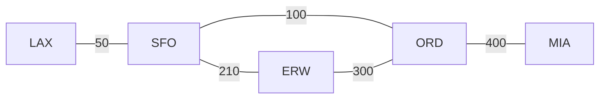

# Problem Set: Graphs II (Flights) — Week 10, Day 2

For every implementation problem, also evaluate the time complexity of your solution. Define your variables and explain why your solution has the stated complexity.

---

## Problem 1: Can Rebook Flight

### Description

Your flight was cancelled and you need to rebook. Given an adjacency matrix `flights` of today's flights, with locations labeled `0` to `n - 1`, where `flights[i][j] = 1` means there is a flight from location `i` to location `j`, write a function `prob01()` that returns `True` if there is a path from your current location `source` to your final destination `dest`, and `False` otherwise.

### Function Signature

```python
def prob01(flights: list[list[int]], source: int, dest: int) -> bool:
    pass
```

### Examples

**Example 1:**
```
Input:  flights = [[0, 1, 0],
                   [0, 0, 1],
                   [0, 0, 0]],
        source = 0, dest = 2
Output: True
```

**Example 2:**
```
Input:  flights = [[0, 1, 0, 1, 0],
                   [0, 0, 0, 1, 0],
                   [0, 0, 0, 0, 1],
                   [0, 0, 0, 0, 0],
                   [0, 0, 0, 0, 0]],
        source = 0, dest = 2
Output: False
```

---

## Problem 2: Can Rebook Flight II

### Description

If you solved Problem 1 with breadth first search (BFS), solve it again with depth first search (DFS). If you used DFS, use BFS. The function `prob02()` behaves exactly like Problem 1.

### Function Signature

```python
def prob02(flights: list[list[int]], source: int, dest: int) -> bool:
    pass
```

### Examples

Same as Problem 1: `True` for the first matrix (`0 -> 2`) and `False` for the second (`0 -> 2`).

---

## Problem 3: Number of Flights

### Description

You have an adjacency matrix `flights` with `n` airports labeled `0` to `n - 1`, where `flights[i][j] = 1` means there is a flight from airport `i` to airport `j`. Write a function `prob03()` that returns the minimum number of flights (edges) needed to travel from airport `i` to airport `j`, or `-1` if it is not possible.

### Function Signature

```python
def prob03(flights: list[list[int]], i: int, j: int) -> int:
    pass
```

### Examples

```
flights = [[0, 1, 1, 0, 0],   # Airport 0
           [0, 0, 1, 0, 0],   # Airport 1
           [0, 0, 0, 1, 0],   # Airport 2
           [0, 0, 0, 0, 1],   # Airport 3
           [0, 0, 0, 0, 0]]   # Airport 4
```

**Example 1:**
```
Input:  flights, i = 0, j = 2
Output: 1
Explanation: 0 -> 2
```

**Example 2:**
```
Input:  flights, i = 0, j = 4
Output: 3
Explanation: 0 -> 2 -> 3 -> 4
```

**Example 3:**
```
Input:  flights, i = 4, j = 0
Output: -1
Explanation: There is no way to fly from airport 4 to airport 0.
```

---

## Problem 4: Number of Airline Regions

### Description

Some airports are connected by direct flights. If airport `a` connects directly to `b`, and `b` to `c`, then `a` is indirectly connected to `c`. An **airline region** is a group of directly or indirectly connected airports with no connection to any airport outside the group.

Given an `n x n` matrix `is_connected`, where `is_connected[i][j] = 1` if there is a direct flight between airports `i` and `j` and `0` otherwise, write a function `prob04()` that returns the number of airline regions.

### Function Signature

```python
def prob04(is_connected: list[list[int]]) -> int:
    pass
```

### Examples

**Example 1:**
```
Input:  is_connected = [[1, 1, 0],
                        [1, 1, 0],
                        [0, 0, 1]]
Output: 2
```

**Example 2:**
```
Input:  is_connected = [[1, 0, 0, 1],
                        [0, 1, 1, 0],
                        [0, 1, 1, 0],
                        [1, 0, 0, 1]]
Output: 2
```

---

## Problem 5: Get Flight Cost

### Description

You are given an adjacency dictionary `flights`, where `flights[source]` is a list of `(destination, cost)` tuples, each meaning there is a flight from `source` to `destination` with ticket price `cost`. Write a function `prob05()` that returns the total cost of flying from `start` to `dest`, or `-1` if it is not possible. If there are several paths, return the cost of any one of them.

_Note: the source example has a syntax error, `('ERW': 300)`; it should be `('ERW', 300)`._

### Function Signature

```python
def prob05(flights: dict[str, list[tuple[str, int]]], start: str, dest: str) -> int:
    pass
```

### Examples

**Example 1:**



```
Input:  flights = {
            'LAX': [('SFO', 50)],
            'SFO': [('LAX', 50), ('ORD', 100), ('ERW', 210)],
            'ERW': [('SFO', 210), ('ORD', 300)],
            'ORD': [('ERW', 300), ('SFO', 100), ('MIA', 400)],
            'MIA': [('ORD', 400)]
        },
        start = 'LAX', dest = 'MIA'
Output: 550
Explanation: LAX -> SFO -> ORD -> MIA costs 50 + 100 + 400 = 550.
960 (LAX -> SFO -> ERW -> ORD -> MIA) is also accepted.
```

---

## Problem 6: Fixing Flight Booking Software (SKIPPED)

_Debugging problem — no new implementation._

### Description

CodePath Airlines uses breadth first search to suggest the route with the fewest layovers, but the software has a bug. When working, the function takes an adjacency dictionary `flights` and returns a list with the shortest path from `source` to `destination`.

- Identify and fix the bug(s) in the code.
- Evaluate the time complexity of the function.
- If the airline used an adjacency matrix instead of an adjacency dictionary, would the time complexity change? Why or why not?

### Starter Code

```python
from collections import deque

def find_shortest_path(flights, source, destination):
    queue = deque([(source, [])])
    visited = set()

    while queue:
        current, path = queue.popleft()

        if current == destination:
            return path

        visited.add(current)

        for neighbor in flights.get(current, []):
            if neighbor not in visited:
                queue.append((neighbor, [neighbor]))

    return []
```

### Examples

**Example 1:**
```
Input:  flights = {
            'LAX': ['SFO'],
            'SFO': ['LAX', 'ORD', 'ERW'],
            'ERW': ['SFO', 'ORD'],
            'ORD': ['ERW', 'SFO', 'MIA'],
            'MIA': ['ORD']
        },
        source = 'LAX', destination = 'MIA'
Output: ['LAX', 'SFO', 'ORD', 'MIA']
```

---

## Problem 7: Expanding Flight Offerings

### Description

CodePath Airlines wants every airport it serves to be able to reach every other airport. Flights are tracked in an adjacency dictionary `flights`, where `flights[i]` lists the airports with a flight from airport `i`. Every flight also runs in reverse.

Write a function `prob07()` that returns the minimum number of flights (edges) to add so there is a flight path from each airport to every other airport.

### Function Signature

```python
def prob07(flights: dict[str, list[str]]) -> int:
    pass
```

### Examples

**Example 1:**
```
Input:  flights = {
            'JFK': ['LAX', 'SFO'],
            'LAX': ['JFK', 'SFO'],
            'SFO': ['JFK', 'LAX'],
            'ORD': ['ATL'],
            'ATL': ['ORD']
        }
Output: 1
Explanation: One new flight joins the {JFK, LAX, SFO} group with the {ORD, ATL} group.
```

---

## Problem 8: Get Flight Itinerary

### Description

Given an adjacency dictionary `flights`, where `flights[i]` lists the airports with a flight from airport `i`, write a function `prob08()` that returns a list giving a flight path from `source` to `dest`. If there are several paths, return any one of them.

### Function Signature

```python
def prob08(flights: dict[str, list[str]], source: str, dest: str) -> list[str]:
    pass
```

### Examples

**Example 1:**
```
Input:  flights = {
            'LAX': ['SFO'],
            'SFO': ['LAX', 'ORD', 'ERW'],
            'ERW': ['SFO', 'ORD'],
            'ORD': ['ERW', 'SFO', 'MIA'],
            'MIA': ['ORD']
        },
        source = 'LAX', dest = 'MIA'
Output: ['LAX', 'SFO', 'ORD', 'MIA']
Explanation: ['LAX', 'SFO', 'ERW', 'ORD', 'MIA'] is also accepted.
```

---
