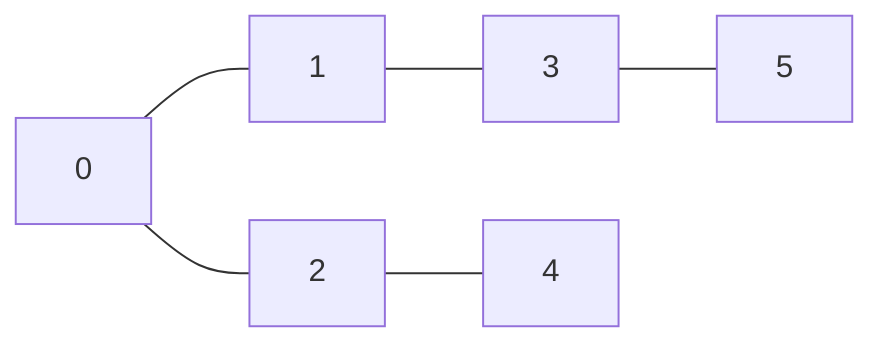
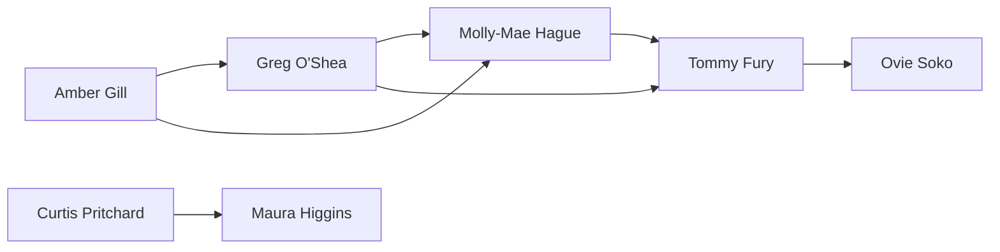
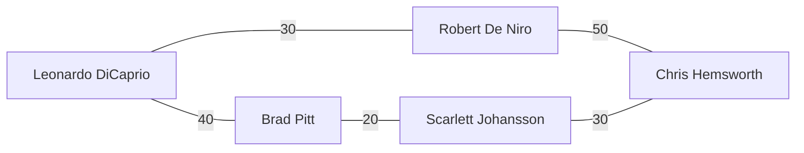

# Problem Set: Graphs II (Hollywood) — Week 10, Day 2

For every implementation problem, also evaluate the time complexity of your solution. Define your variables and explain why your solution has the stated complexity.

---

## Problem 1: Celebrity Collaborations (SKIPPED)

_Code-along problem — no function to implement. Starter code is in `prob01.py`._

### Description

Each vertex in the source's graph (an image, not reproduced here) is an actor. Each undirected edge means two actors have costarred, and its weight is the number of films they made together.

Build an adjacency dictionary `collaborations` for the graph. Each key is an actor's name, and each value is a list of tuples, where `collaborations[actor][i] = (costar, num_collaborations)`.

From the source, `collaborations["Chadwick Boseman"]` should be `[("Lupita Nyong'o", 2), ("Robert Downey Jr.", 3), ("Mark Ruffalo", 2)]`.

---

## Problem 2: Cast vs Crew

### Description

You are given an adjacency list `cast_and_crew`, where each node is a cast or crew member of a movie. There is a path between every two cast members and between every two crew members, but no edge connects the cast to the crew.

Using depth first search, write a function `prob02()` that returns two lists: one with every cast member and one with every crew member. The two lists, and the names inside them, may be in any order.

_Note: the source example calls `get_groups(cast_and_crew)`; it should pass `get_out_movie`._

### Function Signature

```python
def prob02(cast_and_crew: dict[str, list[str]]) -> list[list[str]]:
    pass
```

### Examples

**Example 1:**
```
Input:  cast_and_crew = {
            "Daniel Kaluuya": ["Allison Williams"],
            "Allison Williams": ["Daniel Kaluuya", "Catherine Keener", "Bradley Whitford"],
            "Bradley Whitford": ["Allison Williams", "Catherine Keener"],
            "Catherine Keener": ["Allison Williams", "Bradley Whitford"],
            "Jordan Peele": ["Jason Blum", "Gregory Plotkin", "Toby Oliver"],
            "Toby Oliver": ["Jordan Peele", "Gregory Plotkin"],
            "Gregory Plotkin": ["Jason Blum", "Toby Oliver", "Jordan Peele"],
            "Jason Blum": ["Jordan Peele", "Gregory Plotkin"]
        }
Output: [['Daniel Kaluuya', 'Allison Williams', 'Catherine Keener', 'Bradley Whitford'],
         ['Jordan Peele', 'Jason Blum', 'Gregory Plotkin', 'Toby Oliver']]
```

---

## Problem 3: Bacon Number

### Description

In Six Degrees of Kevin Bacon, you connect any actor to Kevin Bacon through mutual connections. You are given an adjacency dictionary `bacon_network`, where `bacon_network[actor]` lists the actors they have worked with. `"Kevin Bacon"` is always in the graph. Write a function `prob03()` that returns the Bacon Number of `celeb`:

- Kevin Bacon's Bacon Number is 0.
- Actors who worked directly with Kevin Bacon have a Bacon Number of 1.
- If someone worked with `actor_b`, whose Bacon Number is `n`, their Bacon Number is `n + 1`.
- If someone cannot be connected to Kevin Bacon, their Bacon Number is `-1`.

_Note: the source example is missing a comma after the `"Tom Cruise"` entry._

### Function Signature

```python
def prob03(bacon_network: dict[str, list[str]], celeb: str) -> int:
    pass
```

### Examples

```
bacon_network = {
    "Kevin Bacon": ["Kyra Sedgewick", "Forest Whitaker", "Julia Roberts", "Tom Cruise"],
    "Kyra Sedgewick": ["Kevin Bacon", "Tom Cruise"],
    "Tom Cruise": ["Kevin Bacon", "Kyra Sedgewick"],
    "Forest Whitaker": ["Kevin Bacon", "Denzel Washington"],
    "Denzel Washington": ["Forest Whitaker", "Julia Roberts"],
    "Julia Roberts": ["Denzel Washington", "Kevin Bacon", "George Clooney"],
    "George Clooney": ["Julia Roberts", "Vera Farmiga"],
    "Vera Farmiga": ["George Clooney", "Max Theriot"],
    "Max Theriot": ["Vera Farmiga", "Jennifer Lawrence"],
    "Jennifer Lawrence": ["Max Theriot"]
}
```

**Example 1:**
```
Input:  bacon_network, celeb = "Jennifer Lawrence"
Output: 5
```

**Example 2:**
```
Input:  bacon_network, celeb = "Tom Cruise"
Output: 1
```

---

## Problem 4: Press Junket Navigation

### Description

Celebrities are stationed in rooms numbered `0` to `n - 1`. You start at the entrance, room `0`, and need to reach room `target`. Given an adjacency list `venue_map`, where `venue_map[i]` lists the rooms connected to room `i` by a hallway, write a function `prob04()` that returns a list giving a path from room `0` to `target`. If there are several paths, return any one of them.

### Function Signature

```python
def prob04(venue_map: list[list[int]], target: int) -> list[int]:
    pass
```

### Examples



**Example 1:**
```
Input:  venue_map = [[1, 2], [0, 3], [0, 4], [1, 5], [2], [3]], target = 5
Output: [0, 1, 3, 5]
```

**Example 2:**
```
Input:  venue_map = [[1, 2], [0, 3], [0, 4], [1, 5], [2], [3]], target = 2
Output: [0, 2]
```

---

## Problem 5: Gossip Chain

### Description

Celebrities are vertices in a directed graph, and an edge `[a, b]` means `a` passes gossip to `b`. In a depth first search (DFS) from `start`, the **arrival time** of the rumor at a celebrity is when the DFS first reaches them, and the **departure time** is when the DFS finishes everyone reachable from them.

Use one clock, starting at 1, that ticks once at every arrival and once at every departure. Visit neighbors in the order their edges appear in `connections`.

Given the edge list `connections`, the number of celebrities `n`, and `start`, write a function `prob05()` that returns a dictionary mapping every celebrity in `connections` to `(arrival_time, departure_time)`. A celebrity who never hears the rumor maps to `(-1, -1)`.

_Note: the source lists `"Greg O'Shea": (2, 11)` and `"Amber Gill": (1, 12)`. That is impossible: only 5 celebrities hear the rumor, so the clock stops at 10. The correct values are below._

### Function Signature

```python
def prob05(connections: list[list[str]], n: int, start: str) -> dict[str, tuple[int, int]]:
    pass
```

### Examples

**Example 1:**



```
Input:  connections = [
            ["Amber Gill", "Greg O'Shea"],
            ["Amber Gill", "Molly-Mae Hague"],
            ["Greg O'Shea", "Molly-Mae Hague"],
            ["Greg O'Shea", "Tommy Fury"],
            ["Molly-Mae Hague", "Tommy Fury"],
            ["Tommy Fury", "Ovie Soko"],
            ["Curtis Pritchard", "Maura Higgins"]
        ],
        n = 7, start = "Amber Gill"
Output: {
            "Amber Gill": (1, 10),
            "Greg O'Shea": (2, 9),
            "Molly-Mae Hague": (3, 8),
            "Tommy Fury": (4, 7),
            "Ovie Soko": (5, 6),
            "Curtis Pritchard": (-1, -1),
            "Maura Higgins": (-1, -1)
        }
```

---

## Problem 6: Network Strength

### Description

Given an adjacency dictionary `celebrities`, where `celebrities[i]` lists the celebrities that celebrity `i` likes (likes are not necessarily mutual), write a function `prob06()` that returns `True` if the group is strongly connected and `False` otherwise. Here, the group is **strongly connected** if every celebrity likes every other celebrity.

### Function Signature

```python
def prob06(celebrities: dict[str, list[str]]) -> bool:
    pass
```

### Examples

**Example 1:**
```
Input:  celebrities = {
            "Dev Patel": ["Meryl Streep", "Viola Davis"],
            "Meryl Streep": ["Dev Patel", "Viola Davis"],
            "Viola Davis": ["Meryl Streep", "Dev Patel"]
        }
Output: True
```

**Example 2:**
```
Input:  celebrities = {
            "John Cho": ["Rami Malek", "Zoe Saldana", "Meryl Streep"],
            "Rami Malek": ["John Cho", "Zoe Saldana", "Meryl Streep"],
            "Zoe Saldana": ["Rami Malek", "John Cho", "Meryl Streep"],
            "Meryl Streep": []
        }
Output: False
Explanation: Meryl Streep likes nobody.
```

---

## Problem 7: Maximizing Star Power

### Description

You are producing a film and two costars, `costar_a` and `costar_b`, have already signed on. Each vertex in the graph is a celebrity, and each edge between two celebrities is a past collaboration with a star power value.

The graph is a dictionary `collaboration_map`, where each key is a celebrity and each value is a list of `(connected_celebrity, star_power)` tuples. Write a function `prob07()` that returns the maximum total star power of any path between `costar_a` and `costar_b` that does not repeat a celebrity.

### Function Signature

```python
def prob07(collaboration_map: dict[str, list[tuple[str, int]]], costar_a: str, costar_b: str) -> int:
    pass
```

### Examples

**Example 1:**



```
Input:  collaboration_map = {
            "Leonardo DiCaprio": [("Brad Pitt", 40), ("Robert De Niro", 30)],
            "Brad Pitt": [("Leonardo DiCaprio", 40), ("Scarlett Johansson", 20)],
            "Robert De Niro": [("Leonardo DiCaprio", 30), ("Chris Hemsworth", 50)],
            "Scarlett Johansson": [("Brad Pitt", 20), ("Chris Hemsworth", 30)],
            "Chris Hemsworth": [("Robert De Niro", 50), ("Scarlett Johansson", 30)]
        },
        costar_a = "Leonardo DiCaprio", costar_b = "Chris Hemsworth"
Output: 90
Explanation: Leonardo DiCaprio -> Brad Pitt -> Scarlett Johansson -> Chris Hemsworth is 40 + 20 + 30 = 90.
The other path, Leonardo DiCaprio -> Robert De Niro -> Chris Hemsworth, is 30 + 50 = 80.
```

---

## Problem 8: Celebrity Feuds

### Description

You want to split `n` celebrities, labeled `1` to `n`, into two arrival groups for a red carpet event. Celebrities who dislike each other may not be in the same group. Given `n` and a list `dislikes`, where `dislikes[i] = [a, b]` means `a` and `b` don't get along, write a function `prob08()` that returns `True` if such a split is possible and `False` otherwise.

This is checking whether the graph is **bipartite**: its nodes can be split into two sets with every edge going between the sets. One way to check is two-coloring: color a node, color its neighbors the opposite color, and continue (with BFS or DFS). If two adjacent nodes ever need the same color, the graph is not bipartite.

### Function Signature

```python
def prob08(n: int, dislikes: list[list[int]]) -> bool:
    pass
```

### Examples

**Example 1:**
```
Input:  n = 4, dislikes = [[1, 2], [1, 3], [2, 4]]
Output: True
```

**Example 2:**
```
Input:  n = 3, dislikes = [[1, 2], [1, 3], [2, 3]]
Output: False
```

---
