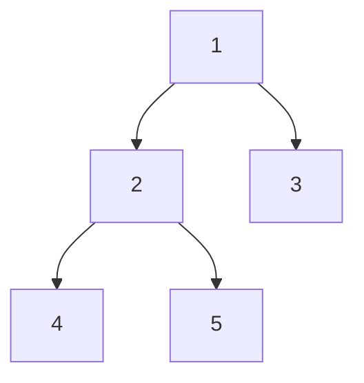
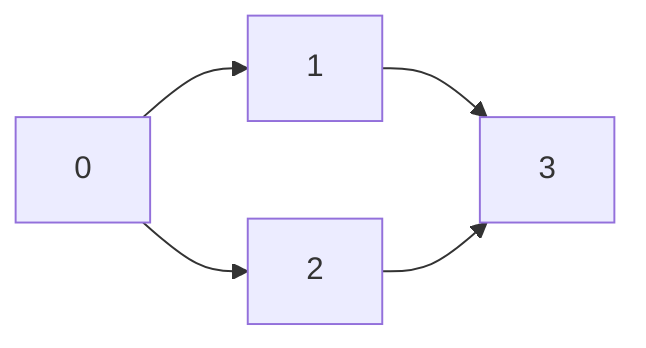
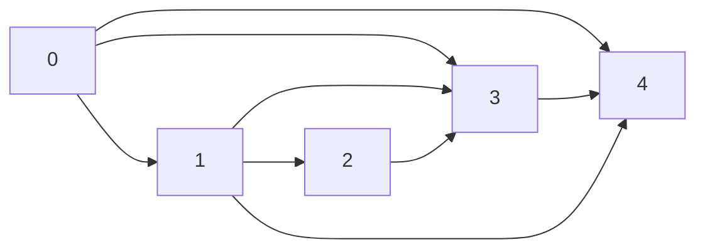

# Problem Set: Review — Week 12, Day 2

Tree problems use the shared `TreeNode` class (`from references import TreeNode`); the attribute is `.val`:

```python
class TreeNode:
    def __init__(self, value, left=None, right=None):
        self.val = value
        self.left = left
        self.right = right
```

Tree examples written as a list describe the tree in **level order**, where `None` means "no node here". `build_tree(values)` turns such a list into a tree, and `print_tree(root)` prints a tree back in the same format.

---

## Problem 1: Valid Anagram

### Description

Given two strings `s` and `t`, write a function `prob01()` that returns `True` if `t` is an anagram of `s` (it uses exactly the same letters, the same number of times) and `False` otherwise.

### Function Signature

```python
def prob01(s: str, t: str) -> bool:
    pass
```

### Examples

**Example 1:**
```
Input:  s = "anagram", t = "nagaram"
Output: True
```

**Example 2:**
```
Input:  s = "rat", t = "car"
Output: False
```

---

## Problem 2: Count Binary Substrings

### Description

Given a binary string `s`, write a function `prob02()` that returns the number of non-empty substrings with the same number of `0`s and `1`s, where all the `0`s are grouped together and all the `1`s are grouped together.

Substrings that occur more than once are counted each time they occur.

### Function Signature

```python
def prob02(s: str) -> int:
    pass
```

### Examples

**Example 1:**
```
Input:  s = "00110011"
Output: 6
Explanation: The substrings are "0011", "01", "1100", "10", "0011", and "01".
"00110011" itself does not count, because its 0s (and 1s) are not grouped together.
```

**Example 2:**
```
Input:  s = "10101"
Output: 4
Explanation: The substrings are "10", "01", "10", and "01".
```

---

## Problem 3: Diameter of a Binary Tree

### Description

Given the `root` of a binary tree, write a function `prob03()` that returns the length of the tree's **diameter**: the longest path between any two nodes, measured in edges. The path may or may not pass through the root.

### Function Signature

```python
def prob03(root: TreeNode | None) -> int:
    pass
```

### Examples

**Example 1:**



```
Input:  root = [1, 2, 3, 4, 5]
Output: 3
Explanation: The path 4 -> 2 -> 1 -> 3 (or 5 -> 2 -> 1 -> 3) has 3 edges.
```

**Example 2:**
```
Input:  root = [1, 2]
Output: 1
```

---

## Problem 4: Meeting Rooms

### Description

Given a list of meeting time intervals `intervals`, where `intervals[i] = [start_i, end_i]`, write a function `prob04()` that returns `True` if a person could attend every meeting (no two meetings overlap) and `False` otherwise.

### Function Signature

```python
def prob04(intervals: list[list[int]]) -> bool:
    pass
```

### Examples

**Example 1:**
```
Input:  intervals = [[0, 30], [5, 10], [15, 20]]
Output: False
```

**Example 2:**
```
Input:  intervals = [[7, 10], [2, 4]]
Output: True
```

---

## Problem 5: Best Time to Buy and Sell Stock

### Description

You are given a list `prices`, where `prices[i]` is a stock's price on day `i`. You may buy one stock on one day and sell it on a later day. Write a function `prob05()` that returns the maximum profit you can make, or `0` if no profit is possible.

### Function Signature

```python
def prob05(prices: list[int]) -> int:
    pass
```

### Examples

**Example 1:**
```
Input:  prices = [7, 1, 5, 3, 6, 4]
Output: 5
Explanation: Buy at price 1 and sell at price 6, for a profit of 6 - 1 = 5.
You can't buy at 1 and sell at 7, because you must buy before you sell.
```

**Example 2:**
```
Input:  prices = [7, 6, 4, 3, 1]
Output: 0
Explanation: Prices only fall, so no transaction makes a profit.
```

---

## Problem 6: Find All Paths From Source to Target

### Description

You are given a directed acyclic graph (DAG) of `n` nodes labeled `0` to `n - 1`, where `graph[i]` lists the nodes you can reach directly from node `i`. Write a function `prob06()` that returns every path from node `0` to node `n - 1`. The paths may be returned in any order.

### Function Signature

```python
def prob06(graph: list[list[int]]) -> list[list[int]]:
    pass
```

### Examples

**Example 1:**



```
Input:  graph = [[1, 2], [3], [3], []]
Output: [[0, 1, 3], [0, 2, 3]]
```

**Example 2:**



```
Input:  graph = [[4, 3, 1], [3, 2, 4], [3], [4], []]
Output: [[0, 4], [0, 3, 4], [0, 1, 3, 4], [0, 1, 2, 3, 4], [0, 1, 4]]
```

---
