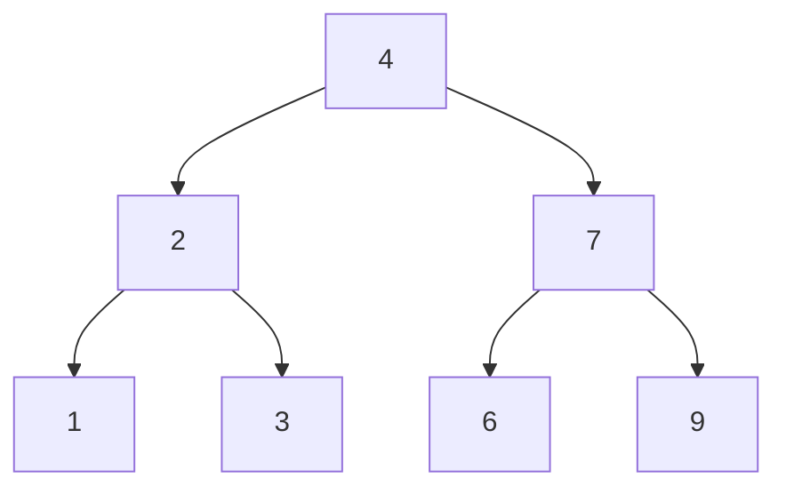
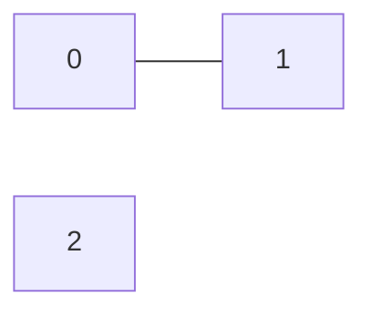
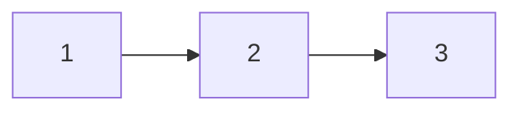

# Problem Set: Review — Week 12, Day 2 (Version 2)

Tree problems use the shared `TreeNode` class (`from references import TreeNode`; attribute `.val`), and linked list problems use the shared `Node` class (`from references import Node`; attribute `.value`):

```python
class TreeNode:
    def __init__(self, value, left=None, right=None):
        self.val = value
        self.left = left
        self.right = right

class Node:
    def __init__(self, value, next=None, prev=None):
        self.value = value
        self.next = next
        self.prev = prev
```

Tree examples written as a list describe the tree in **level order**, where `None` means "no node here". `build_tree(values)` turns such a list into a tree, and `print_tree(root)` prints a tree back in the same format.

---

## Problem 1: Sort Array by Increasing Frequency

### Description

Given a list of integers `nums`, write a function `prob01()` that returns the list sorted in increasing order of how often each value appears. Values with the same frequency are sorted in decreasing order.

### Function Signature

```python
def prob01(nums: list[int]) -> list[int]:
    pass
```

### Examples

**Example 1:**
```
Input:  nums = [1, 1, 2, 2, 2, 3]
Output: [3, 1, 1, 2, 2, 2]
Explanation: 3 appears once, 1 appears twice, and 2 appears three times.
```

**Example 2:**
```
Input:  nums = [2, 3, 1, 3, 2]
Output: [1, 3, 3, 2, 2]
Explanation: 2 and 3 both appear twice, so they are sorted in decreasing order.
```

**Example 3:**
```
Input:  nums = [-1, 1, -6, 4, 5, -6, 1, 4, 1]
Output: [5, -1, 4, 4, -6, -6, 1, 1, 1]
```

---

## Problem 2: Invert Binary Tree

### Description

Given the `root` of a binary tree, write a function `prob02()` that inverts the tree (swaps every node's left and right children) and returns the root.

_Note: the source examples print `tree_1` and `tree_2` without calling `invert_tree()`; the outputs below are for the inverted trees._

### Function Signature

```python
def prob02(root: TreeNode | None) -> TreeNode | None:
    pass
```

### Examples

**Example 1:**



```
Input:  root = [4, 2, 7, 1, 3, 6, 9]
Output: [4, 7, 2, 9, 6, 3, 1]
```

**Example 2:**
```
Input:  root = [2, 1, 3]
Output: [2, 3, 1]
```

---

## Problem 3: Valid Parentheses

### Description

Given a string `s` containing only the characters `'('`, `')'`, `'{'`, `'}'`, `'['` and `']'`, write a function `prob03()` that returns `True` if `s` is valid and `False` otherwise. A string is valid if:

- Open brackets are closed by the same type of bracket.
- Open brackets are closed in the correct order.
- Every close bracket has a matching open bracket of the same type.

### Function Signature

```python
def prob03(s: str) -> bool:
    pass
```

### Examples

**Example 1:**
```
Input:  s = "()"
Output: True
```

**Example 2:**
```
Input:  s = "()[]{}"
Output: True
```

**Example 3:**
```
Input:  s = "(]"
Output: False
```

**Example 4:**
```
Input:  s = "([])"
Output: True
```

**Example 5:**
```
Input:  s = "([)]"
Output: False
```

---

## Problem 4: Is Subsequence

### Description

Given two strings `s` and `t`, write a function `prob04()` that returns `True` if `s` is a subsequence of `t`, and `False` otherwise.

A **subsequence** is formed by deleting some (possibly none) of a string's characters without changing the order of the rest. For example, `"ace"` is a subsequence of `"abcde"`, but `"aec"` is not.

### Function Signature

```python
def prob04(s: str, t: str) -> bool:
    pass
```

### Examples

**Example 1:**
```
Input:  s = "abc", t = "ahbgdc"
Output: True
```

**Example 2:**
```
Input:  s = "axc", t = "ahbgdc"
Output: False
```

---

## Problem 5: Number of Provinces

### Description

There are `n` cities. If city `a` connects directly to city `b`, and `b` to city `c`, then `a` is indirectly connected to `c`. A **province** is a group of directly or indirectly connected cities with no connection to any city outside the group.

Given an `n x n` matrix `is_connected`, where `is_connected[i][j] = 1` if cities `i` and `j` are directly connected and `0` otherwise, write a function `prob05()` that returns the number of provinces.

### Function Signature

```python
def prob05(is_connected: list[list[int]]) -> int:
    pass
```

### Examples

**Example 1:**



```
Input:  is_connected = [[1, 1, 0], [1, 1, 0], [0, 0, 1]]
Output: 2
```

**Example 2:**
```
Input:  is_connected = [[1, 0, 0], [0, 1, 0], [0, 0, 1]]
Output: 3
```

---

## Problem 6: Split Linked List in Parts

### Description

Given the `head` of a singly linked list and an integer `k`, write a function `prob06()` that splits the list into `k` consecutive parts and returns a list of the `k` part heads.

- Part sizes must be as equal as possible: no two parts may differ in size by more than one. This can leave some parts empty (`None`).
- Parts keep the order of the original list, and earlier parts are never smaller than later parts.

_Note: the source examples loop over `list_1`/`list_2` instead of the returned parts; the outputs below print each returned part._

### Function Signature

```python
def prob06(head: Node | None, k: int) -> list[Node | None]:
    pass
```

### Examples

**Example 1:**



```
Input:  head = 1 -> 2 -> 3, k = 5
Output: [1], [2], [3], None, None
Explanation: The first three parts have one node each; the last two parts are empty.
```

**Example 2:**
```
Input:  head = 1 -> 2 -> 3 -> 4 -> 5 -> 6 -> 7 -> 8 -> 9 -> 10, k = 3
Output: 1 -> 2 -> 3 -> 4
        5 -> 6 -> 7
        8 -> 9 -> 10
Explanation: Sizes 4, 3, 3 differ by at most one, and the larger part comes first.
```

---
